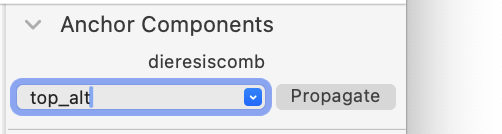

# Anchor Components

Glyphs.app palette plug-in for batch-editing component anchorings.

*After installation, Anchor Components will appear in the app palette on the right side (Cmd-Opt-P).*

### Usage

Select a component (typically a mark) and pick (or type the name of) an anchor in the combo box. The selected component will be reanchored to the new anchor.

If you keep the combo box empty, the component will be unanchored.

Click the *Propagate* button to apply the component and anchoring structure of the current master to all other masters of the active glyph.

### Installation

1. Open *Window > Plugin Manager*
2. Find *Anchor Components* and click the *Install* button
3. Restart Glyphs.app

### License

Copyright 2024 Rainer Erich Scheichelbauer (@mekkablue).
Based on sample code by Georg Seifert (@schriftgestalt).

Licensed under the Apache License, Version 2.0 (the "License");
you may not use this file except in compliance with the License.
You may obtain a copy of the License at

http://www.apache.org/licenses/LICENSE-2.0

See the License file included in this repository for further details.
